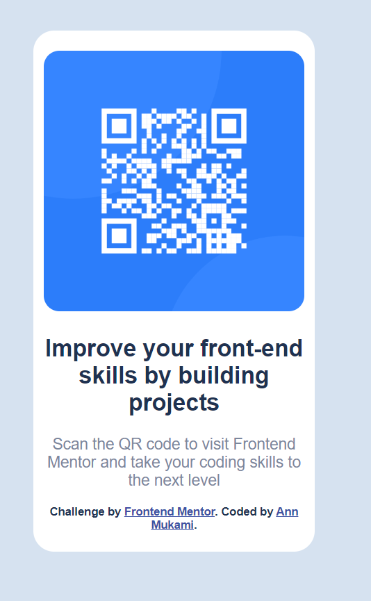

# Frontend Mentor - QR code component solution

This is a solution to the [QR code component challenge on Frontend Mentor](https://www.frontendmentor.io/challenges/qr-code-component-iux_sIO_H). Frontend Mentor challenges help you improve your coding skills by building realistic projects. 

## Table of contents

- [Overview](#overview)
  - [Screenshot](#screenshot)
  - [Links](#links)
- [My process](#my-process)
  - [Built with](#built-with)
  - [What I learned](#what-i-learned)
  - [Continued development](#continued-development)
  - [Useful resources](#useful-resources)
- [Author](#author)
- [Acknowledgments](#acknowledgments)

**Note: Delete this note and update the table of contents based on what sections you keep.**

## Overview

### Screenshot




### Links

- Solution URL: [https://github.com/Kiunga1/frontend-mentor-project.git]()
- Live Site URL: [Add live site URL here](https://your-live-site-url.com)

## My process

### Built with

- Semantic HTML5 markup
- CSS custom properties
- Flexbox
- CSS Grid
- Mobile-first workflow

### What I learned

My major learning sections while working through this project are:
1. Applying rounded borders.
2. Selecting element by use of classes and Id's.
3. Selecting more than one element.
```css
img {
    
    border: 0;
    border-radius: 15px;
}
#qrCode {
    background-color: hsl(0, 0%, 100%);
    padding: 5px;
    height: 500px;
    width: 270px;
    max-width: 400px;
    border: 0;
    border-radius: 20px;
  }

 h1, .attribution {
    font-weight: 700;
    color: hsl(218, 44%, 22%);
  }
```


### Continued development

Looking forward to learning more in the folowing areas:
-Responsive web development
-Flexbox

### Useful resources

- [Acomplete guide to flexbox](https://css-tricks.com/snippets/css/a-guide-to-flexbox/) - This helped me with perfecting the layout of my project. I really liked how well summarized the concepts were. I will be using this tricks going forward.
- [CSS Rounded Corners](https://www.w3schools.com/css/css3_borders.asp) - This is an amazing article which helped me finally understand applying rounded corners to CSS. I'd recommend it to anyone still learning this concept.

## Author

- Website - [Ann Mukami](https://www.your-site.com)
- Frontend Mentor - [@Kiunga1](https://www.frontendmentor.io/profile/Kiunga1)
- Twitter - [@AnnKiungaa](https://www.twitter.com/AnnKiungaa)

## Acknowledgments

This is where you can give a hat tip to anyone who helped you out on this project. Perhaps you worked in a team or got some inspiration from someone else's solution. This is the perfect place to give them some credit.

**Note: Delete this note and edit this section's content as necessary. If you completed this challenge by yourself, feel free to delete this section entirely.**
